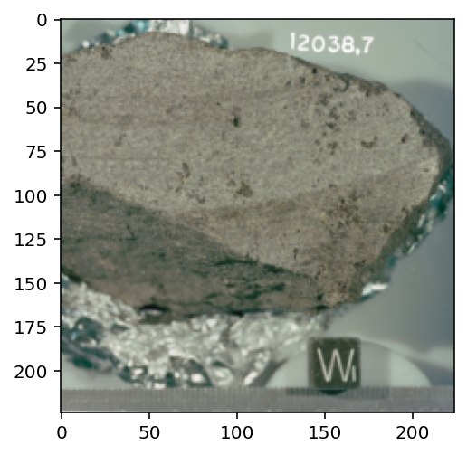
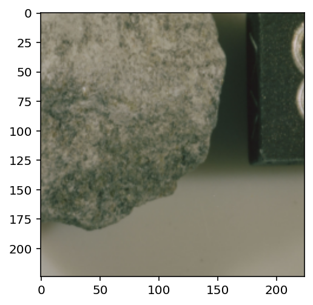

# Analysis of space rocks using PyTorch. 

This is a simple project with the objective of recreating image classification using this prestigious library.

## Requirements

    pip install -r requirements.txt

## Train
&nbsp;  To load, train and check how the program works, you need to run the main script file *train.py*.

    python train.py
    
    Epoch 0/25
    ====================================================================================================
    train Loss: 0.6629 Acc: 0.6194
    test Loss: 0.6376 Acc: 0.6065
    .
    .
    .
    Epoch 25/25
    ====================================================================================================
    train Loss: 0.2160 Acc: 0.9548
    test Loss: 0.2092 Acc: 0.9677

    Best val Acc: 0.967742

# Overview
&nbsp; Use of a neural network to learn the associations between features (curves, edges, and texture) and each rock type.

    device = torch.device("cuda" if torch.cuda.is_available() else "cpu")
    model = models.resnet50(pretrained=True)

&nbsp; Once the program completes its first phase will be ready to show some random examples randomly (numSamples). Now we can see some images of our dataset, we can also access them in the '/Data' folder. 

    images, labels = ml_classifier.randomSamples(testTransforms, numSamples=5)
    toPil = transforms.ToPILImage()
    fig = plt.figure(figsize=(20,20))
    classes = ml_classifier.classNames

    for ii in range(len(images)):
      image = toPil(images[ii])
      sub = fig.add_subplot(1, len(images), ii+1)
      plt.imshow(image)
      plt.pause(0.01)

    plt.title = classes
    plt.show()

###### matplotlib plots
  
  
  
  

