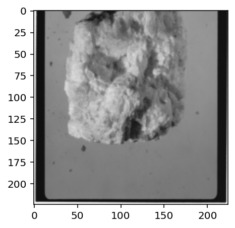
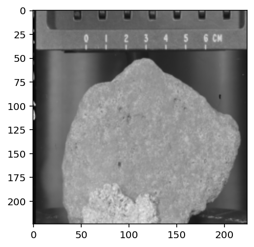

## Installing libraries 
 
    pip install -r requirements.txt
 

## Train
&nbsp;  file *train.py*.
    
    Epoch 0/25
    ====================================================================================================
    train Loss: 1.2328 Acc: 0.6000
    test Loss: 0.7766 Acc: 0.5871
    .
    .
    .
    Epoch 19/25
    ====================================================================================================
    train Loss: 0.3478 Acc: 0.8452
    test Loss: 0.1647 Acc: 0.9935
    .
    Epoch 25/25
    ====================================================================================================
    train Loss: 0.3057 Acc: 0.8387
    test Loss: 0.1617 Acc: 0.9742

    Best val Acc: 0.993548

 

# Overview
&nbsp; Once the program completes its first phase will be ready to show some random examples. Now we can see some images of our dataset, we can also access them in the '/Data' folder. 

    images, labels = ml_classifier.randomSamples(testTransforms, numSamples=5)
    toPil = transforms.ToPILImage()
    fig = plt.figure(figsize=(20,20))
    classes = ml_classifier.classNames

    for ii in range(len(images)):
      image = toPil(images[ii])
      sub = fig.add_subplot(1, len(images), ii+1)
      plt.imshow(image)
      plt.pause(0.01)

    plt.title = classes
    plt.show()

 

##### images
  
  

    # Save pre-trained model
    torch.save(model, 'model.pth')

 

Notebook:  
* [Notebook](https://github.com/ellhe-blaster/moon-rocks/blob/main/Notebook.ipynb)

Information about dataset:  
* [Lunar Rocks and Soils from Apollo Missions](https://curator.jsc.nasa.gov/lunar/index.cfm)  
