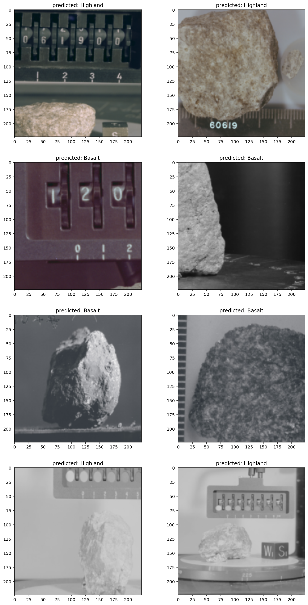

# Space rocks image classification using PyTorch

&nbsp; This is a simple program with the objective of recreate image classification using PyTorch.
 
 
 
## Requirements

    pip install -r requirements.txt
 

## Train
&nbsp;  To load, train and check how the program works, you need to run the main script file *train.py*.
    
    Epoch 0/25
    ====================================================================================================
    train Loss: 1.2328 Acc: 0.6000
    test Loss: 0.7766 Acc: 0.5871
    .
    .
    .
    Epoch 19/25
    ====================================================================================================
    train Loss: 0.3478 Acc: 0.8452
    test Loss: 0.1647 Acc: 0.9935
    .
    Epoch 25/25
    ====================================================================================================
    train Loss: 0.3057 Acc: 0.8387
    test Loss: 0.1617 Acc: 0.9742

    Best val Acc: 0.993548

 

# Overview
&nbsp; Use of a neural network to learn the associations between features (curves, edges, and texture) and each rock type.

    device = torch.device("cuda" if torch.cuda.is_available() else "cpu")
    model = models.resnet50(pretrained=True)
    
  

&nbsp; Once the program completes its first phase will be ready to show some random examples randomly (numSamples). Now we can see some images of our dataset, we can also access them in the '/Data' folder. 

    images, labels = ml_classifier.randomSamples(testTransforms, numSamples=5)
    toPil = transforms.ToPILImage()
    fig = plt.figure(figsize=(20,20))
    classes = ml_classifier.classNames

    for ii in range(len(images)):
      image = toPil(images[ii])
      sub = fig.add_subplot(1, len(images), ii+1)
      plt.imshow(image)
      plt.pause(0.01)

    plt.title = classes
    plt.show()

 

##### images
  
  
  
  

    # Save pre-trained model
    torch.save(model, 'model.pth')
 

 

If you are intereseted to learn more abou it, check the following link:  
* [PyTorch - Transfer learning tutorial](https://pytorch.org/tutorials/beginner/transfer_learning_tutorial.html)  
